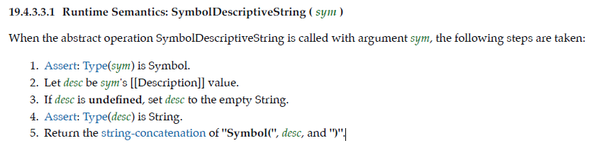
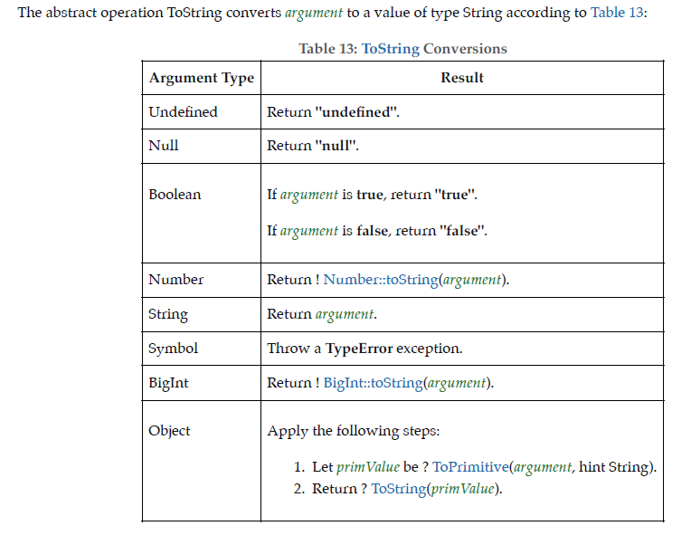
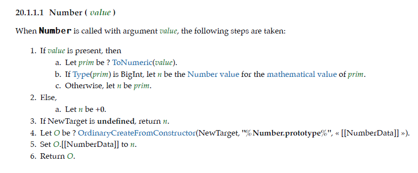
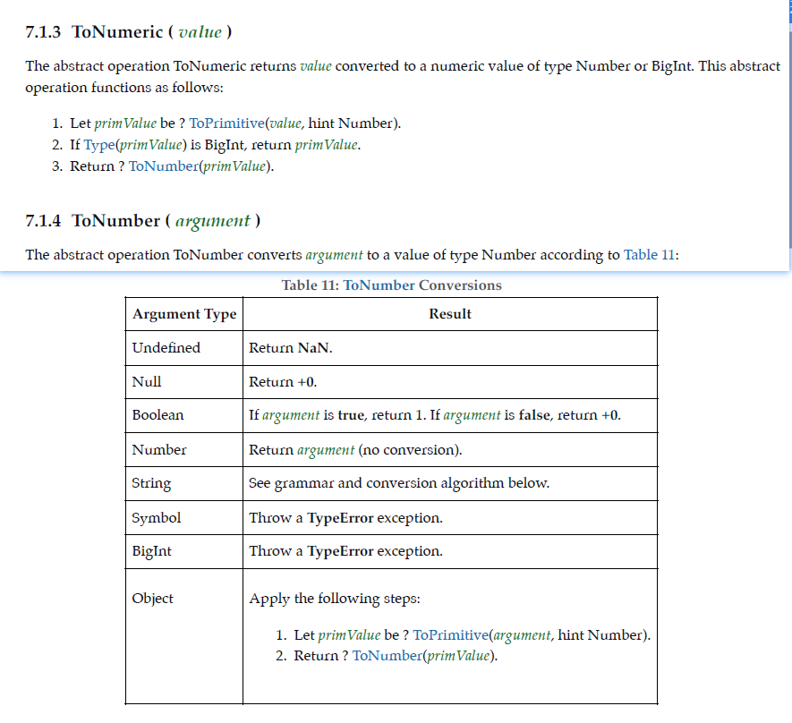
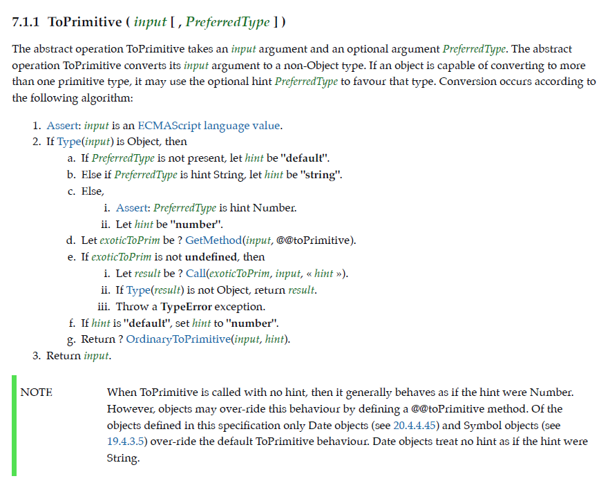

## 前言

作为弱类型语言，`js`的类型一直很让人头疼，尤其是类型转换，先来搞一搞。
`js`的8种语言类型`Undefined、Null、Boolean、String、Number、Symbol、BigInt、Object`

参考：

- [JavaScript 深入之头疼的类型转换(上)](https://github.com/mqyqingfeng/Blog/issues/159)
- [js之深入系列之头疼的类型转换(下)](https://github.com/mqyqingfeng/Blog/issues/164)
- [ECM-262(11.0)](http://www.ecma-international.org/ecma-262/11.0/index.html#title)

## 基本类型之间的转换

### 原始值转布尔

调用`Boolean`进行转换，在`js`中转成`false`的原始值就只有以下几种

```js
console.log(Boolean()) // false

console.log(Boolean(false)) // false

console.log(Boolean(undefined)) // false
console.log(Boolean(null)) // false
console.log(Boolean(+0)) // false
console.log(Boolean(-0)) // false
console.log(Boolean(NaN)) // false
console.log(Boolean('')) // false
console.log(Boolean(0n)) // false
```


### 原始值转字符

使用 `String` 函数将类型转换成字符串类型，`ECM-262` 规范是这样写的

> When String is called with argument value, the following steps are taken:
> 1. If value is not present, let s be the empty String. 
> 2. Else,
>     a. If NewTarget is undefined and Type(value) is Symbol, return SymbolDescriptiveString(value).
>     b. Let s be ? ToString(value).
> 3.If NewTarget is undefined, return s.
> 4. Return ! StringCreate(s, ? GetPrototypeFromConstructor(NewTarget, "%String.prototype%")).

我是这样理解的，`String`被调用可以分为两种情况

1. 普通函数调用
    - 如果没传入值，那么就直接返回空字符串`''`(1，3步骤)
    - 如果传入值了，但是值的类型是`Symbol`，就返回`SymbolDescriptiveString(value)`的调用结果（2a步骤）
    - 如果传入值了，但是值的类型不是`Symbol`，返回`ToString(value)`的调用结果（2b步骤）
 
 2. `new`调用（装箱转换）
    - 直接返回`! StringCreate(s, GetPrototypeFromConstructor(NewTarget, "%String.prototype%"))`

先不考虑装箱转换，那么先来看`SymbolDescriptiveString(value)`的调用结果



这个的大概意思就是下面代码的执行结果，值得一提的是`Symbol(desc)`传入的`desc`最终会通过`ToString`转换为字符串，所以`desc`是不能传入`Symbol`类型

```js
console.log(String(Symbol())) // Symbol()
console.log(String(Symbol('test'))) // Symbol(test)

console.log(String(Symbol({}))) // Symbol([object Object])   
```

再来看`ToString(value)`的调用结果



先不看`Object`转字符串的调用结果，那么其他的调用结果就是

```js
console.log(String(undefined)) // undefined
console.log(String(null)) // null

console.log(String(false)) // false
console.log(String(true)) // true
//Number
console.log(String(0)) // 0
console.log(String(-0)) // 0
console.log(String(-1)) // -1
console.log(String(1)) // 1
console.log(String(NaN)) // NaN
console.log(String(Infinity)) // Infinity
console.log(String(-Infinity)) // -Infinity
//BigInt
console.log(String(0n)) // 0
console.log(String(-0n)) // 0
console.log(String(10000n)) // 10000
console.log(String(-10000n)) // 10000
```

值得一提的是 `Number` 类型有一定的转换规则，超过一定值会转换成科学计数法，正常情况用不到的，这里就不说了

### 原始值转数字

同样的我们看下`Number`的规范



与`String`类似也是两种情况，先来说`ToNumeric(value)`



可以看到结果是 `ToNumber`的调用值，当时在这之前调用了`ToPrimitive ( value， hint number)`，那这又是啥？他其实就是把输入值转换为原始值的，我们先说原始值之间的转换，那么他调用的返回值就是原来的`value`，至于对象的我们后面再说。

那么除了`BigInt`和 `String` 类型，现在我们可以知道其他类型的转换结果

```js
console.log(Number()) // +0

console.log(Number(undefined)) // NaN
console.log(Number(null)) // +0

console.log(Number(false)) // +0
console.log(Number(true)) // 1
```

`String` 类型的转换规则比较复杂，说实话，我也没看懂，参考了[大佬的文章](https://github.com/mqyqingfeng/Blog/issues/159)，他是这么说的

>如果通过 Number 转换函数传入一个字符串，它会试图将其转换成一个整数或浮点数，而且会忽略所有前导的 0，如果有一个字符不是数字，结果都会返回 NaN，鉴于这种严格的判断，我们一般还会使用更加灵活的 parseInt 和 parseFloat 进行转换。
>parseInt 只解析整数，parseFloat 则可以解析整数和浮点数，如果字符串前缀是 "0x" 或者"0X"，parseInt 将其解释为十六进制数，parseInt 和 parseFloat 都会跳过任意数量的前导空格，尽可能解析更多数值字符，并忽略后面的内容。如果第一个非空格字符是非法的数字直接量，将最终返回 NaN

```js
console.log(Number("123")) // 123
console.log(Number("-123")) // -123
console.log(Number("1.2")) // 1.2
console.log(Number("000123")) // 123
console.log(Number("-000123")) // -123

console.log(Number("0x11")) // 17

console.log(Number("")) // 0
console.log(Number(" ")) // 0

console.log(Number("123 123")) // NaN  ！！！！！注意这个案例
console.log(Number("foo")) // NaN
console.log(Number("100a")) // NaN

console.log(parseInt("3 abc")) // 3       和上面有区别的
console.log(parseFloat("3.14 abc")) // 3.14
console.log(parseInt("-12.34")) // -12
console.log(parseInt("0xFF")) // 255
console.log(parseFloat(".1")) // 0.1
console.log(parseInt("0.1")) // 0

```

那么接下来看看`BigInt`类型，原文的翻译是这样的“让n为prim的数学值的数值。”，emmm……，我还是没看懂😂，但这不影响我做测试，结果是这样的

```js
console.log(Number(1n))// 1
console.log(Number(-1n))// -1
console.log(Number(0n))// 0
console.log(Number(100000000000000000000000n))// 1e+23
```

MDN上提到了一个建议：**由于在 Number 与 BigInt 之间进行转换会损失精度，因而建议仅在值可能大于2^53 时使用 BigInt 类型，并且不在两种类型之间进行相互转换**，所以不用太考虑 Number 与 BigInt 之间的转换

### 其他

- `BigInt(value)`

```js
console.log(BigInt()) // TypeError
console.log(BigInt(undefined)) // TypeError
console.log(BigInt(null)) // TypeError

console.log(BigInt(true)) // 1n
console.log(BigInt(false))// 0n

console.log(BigInt('123')) //123n
console.log(BigInt('-123')) // -123n
console.log(BigInt('0xFF')) // 255n
console.log(BigInt('1.2')) // SyntaxError
console.log(BigInt('faa')) // SyntaxError
console.log(BigInt('123faa')) // SyntaxError
console.log(BigInt('')) // 0n
console.log(BigInt(' ')) // 0n

console.log(BigInt(12)) // 12n
console.log(BigInt(-12)) // -12n
```

- `Symbol(desc)` 
- 获得`ToString(desc)`的返回值`descString`
- 返回一个`[[Description]]`值为`descString`的 `Symbol`类型值


## 对象与原始值之间

### 装箱转换（原始值转对象）

每一种基本类型 `Number、String、Boolean、Symbol、BigInt` 在对象中都有对应的类，所谓装箱转换，正是把基本类型转换为对应的对象。然后就可以调用对象的方法了。

`null` 和 `undefined` 属于例外，当将它们用在期望是一个对象的地方都会造成一个类型错误 ( `TypeError` ) 异常，而不会执行正常的转换。

对于`Number、String、Boolean`我们只要用`new`调用其构造函数就可以了

```js
const num = 1
console.log(typeof num) // number
const numObj = new Number(num)
console.log(typeof numObj) // object
console.log(numObj instanceof Number) // true

const str = '1'
console.log(typeof str) // string
const strObj = new String(str)
console.log(typeof strObj) // object
console.log(strObj instanceof String) // true

const bool = true
console.log(typeof bool) // boolean
const boolObj = new Boolean(bool)
console.log(typeof boolObj) // object
console.log(boolObj instanceof Boolean) // true
```

但是呢，`Symbol、BigInt`比较特殊，他们不能用`new`调用，会报`TypeError`。但可以使用内置的 `Object` 函数，我们可以在 `JavaScript` 代码中显式调用装箱能力。

```js
var symbolObject = Object(Symbol("a")); 
console.log(typeof symbolObject); //object 
console.log(symbolObject instanceof Symbol); //true 
console.log(symbolObject.constructor == Symbol); //true

const bigIntObject = Object(BigInt(1000)); 
console.log(typeof bigIntObject); //object 
console.log(bigIntObject instanceof BigInt); //true 
console.log(bigIntObject.constructor == BigInt); //true
```

### 拆箱转换

对象到布尔值的转换非常简单：所有对象(包括数组和函数)都转换为 `true`。

```js
console.log(Boolean(new Boolean(false))) // true
```

对象到 `String` 和 `Number` 的转换都遵循“先拆箱再转换”的规则。通过拆箱转换，把对象变成基本类型，再从基本类型转换为对应的 `String` 或者 `Number`。

在上面的原始值转字符串和数字的 `ECM` 标准里都提到了 `Object`到其对应原始类型会经过一个`ToPrimitive`函数处理，这个函数就是负责对象类型到基本类型的转换（即，拆箱转换）。

那么我们来看看`ToPrimitive`



这段的解释我直接 [`Copy`大佬的解释](https://github.com/mqyqingfeng/Blog/issues/159)

第一个参数是 `input`，表示要处理的输入值。

第二个参数是 `PreferredType`，非必填，表示希望转换成的类型，有两个值可以选，`Number` 或者 `String`。

当不传入 `PreferredType` 时，如果 `input` 是日期类型，相当于传入 `String`，否则，都相当于传入 `Number`。

如果传入的 `input` 是原始类型，直接返回该值。

如果是 `ToPrimitive(obj, Number)`，处理步骤如下：

1. 如果 `obj` 为 基本类型，直接返回
2. 否则，调用 `valueOf` 方法，如果返回一个原始值，则 `JavaScript` 将其返回。
3. 否则，调用 `toString` 方法，如果返回一个原始值，则 `JavaScript` 将其返回。
4. 否则，`JavaScript` 抛出一个类型错误异常。

如果是 `ToPrimitive(obj, String)`，处理步骤如下：

1. 如果 `obj` 为 基本类型，直接返回
2. 否则，调用 `toString` 方法，如果返回一个原始值，则 `JavaScript` 将其返回。
3. 否则，调用 `valueOf` 方法，如果返回一个原始值，则 `JavaScript` 将其返回。
4. 否则，`JavaScript` 抛出一个类型错误异常。

```js
const o = {
  valueOf : () => {console.log("valueOf"); return {}},
  toString : () => {console.log("toString"); return {}}
}

String(o)
// toString
// valueOf
// TypeError
Number(o)
// valueOf
// toString
// TypeError


```

就像上面的代码执行的结果一样，至于`toString` 方法和`valueOf`方法不了解的可以直接[看大佬文章](https://github.com/mqyqingfeng/Blog/issues/159)

**注意：在 ES6 之后，还允许对象通过显式指定 @@toPrimitive Symbol 来覆盖原有的行为。**

```js
const o = {
  valueOf : () => {console.log("valueOf"); return {}},
  toString : () => {console.log("toString"); return {}}
}
o[Symbol.toPrimitive] = () => {console.log("toPrimitive"); return "1"}

const tStr = String(o) // toPrimitive
console.log(tStr, typeof tStr) // 1 string

const tNum = Number(o) // toPrimitive
console.log(tNum,typeof tNum) //1 number
```

## 隐式类型转换

隐式类型转换看大佬的博客👇

[js之深入系列之头疼的类型转换(下)](https://github.com/mqyqingfeng/Blog/issues/164)


## 总结
