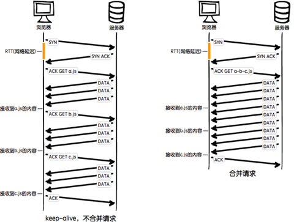

## 资源压缩与合并

- 减少http请求数量 合并请求

- 减少请求资源大小 代码压缩 

### 浏览器从发送到返回都经历了什么

DNS解析-》发送请求-》服务端处理-》浏览器解析执行

1. udns是否可以通过缓存减少dns查询时间？
2. 网络请求的过程走最近的网络环境？
3. 相同的静态资源是否可以缓存？
4. 能否减少请求http请求大小？
5. 减少http请求
6. 服务端渲染

代码压缩

文件合并

不合并缺点：

- 文件与文件之前有插入的上行请求，则加了N-1网络延迟
- 丢包问题影响严重
- 经过代理服务器时可能会被断开

合并的缺点：

- 首屏渲染问题
- 缓存失效问题
- 公共库合并
- 不同页面的合并
- 见机行事，随机应变