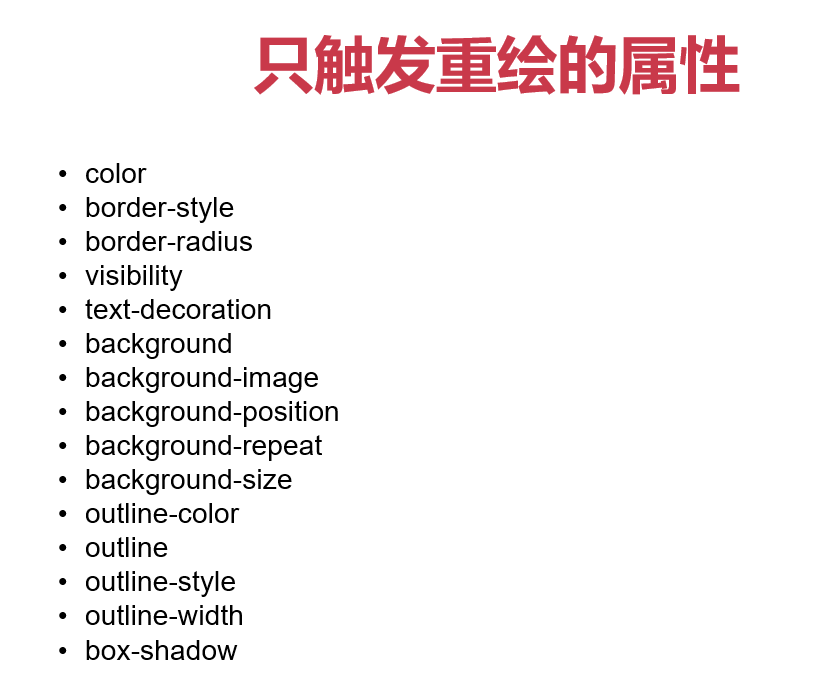

## 回流

- 当render tree中的一部分(或全部)因为**元素的规模尺寸，布局，隐藏等改变**而需要重新构建。这就称为回流(reflow)

- 当页面布局和几何属性改变时就需要回流

## 重绘

- 当render tree中的一些元素需要更新属性，而这些属性只是**影响元素的外观，风格**，而不会影响布局的，比如background-color。则就叫称为重绘

**回流必将引起重绘，而重绘不一定会引起回流**

