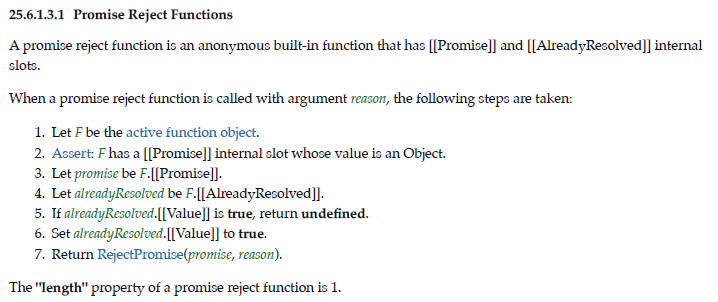
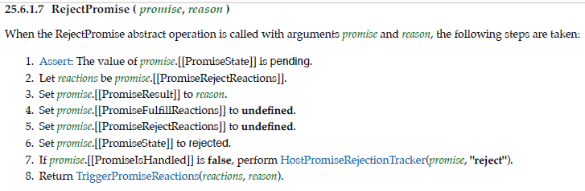

## `Promise`的定义

ECM-262上的解释有以下几点

>原文：
>
>1. is the intrinsic object %Promise%.
>2. is the initial value of the "Promise" property of the global object.
>3. creates and initializes a new Promise object when called as a constructor.
>4. is not intended to be called as a function and will throw an exception when called in that manner.
>5. is designed to be subclassable. It may be used as the value in an extends clause of a class definition. Subclass constructors that intend to inherit the specified Promise behaviour must include a super call to the Promise constructor to create and initialize the subclass instance with the internal state necessary to support the Promise and Promise.prototype built-in methods.
>
>翻译：
>
>1. 是内置对象
>2. 是全局对象的“Promise”属性的初始值
>3. 作为构造函数调用的时候创建新的”Promise“实例
>4. 函数调用的方式会报错
>5. 可被子类化（继承）。类定义的时候可以用在`extends`后面。子类构造器如果想继承特定的“Promise”的行为，那么必须有一个”Promise“的“super”调用。这样才能使用 Promise 一些必要的内部状态来创建和初始化子类的实例，使其支持 Promise 和 Promise.prototype 的内置方法

除了第2点其实都好理解，这一点在浏览器环境下就如同如下的代码

```js
const Prom = window.Promise
const tProm = new Prom((resolve, reject) => {
  resolve(1)
})
tProm.then((val) => console.log(val)) // 1
```

## `new Promise`经历了啥？

直接上原文定义


来翻译下他干了啥？

1. 不是`new`调用，报类型错误
2. 判断传入的参数是否是函数，不是就报错。**`IsCallable`内部逻辑是判断有无 `[[Call]]`内部方法**
3. 获取`OrdinaryCreateFromConstructor`的执行结果`promise`。**`OrdinaryCreateFromConstructor`这个方法是创建以一个对象，让其原型变成`Promise.prototype`，同时设置对象特有的内部方法和属性**
4. 改变实例`promise`的内部属性`[[PromiseState]]`为`pending`
5. 设置实例`promise`的内部属性`[[PromiseFulfillReactions]]`为空的记录列表（**我的理解，这是参数记录，这里存的是参数列表**）
6. 设置实例`promise`的内部属性`[[PromiseRejectReactions]]`为空的记录列表
7. 设置实例`promise`的内部属性`[[PromiseIsHandled]]`为`false`
8. 获取`CreateResolvingFunctions(promise)`的执行结果`resolvingFunctions`。**这步的意思，按我的理解，其实就是根据对应的算法创建实例`promise`对应的解析函数，相当于定义时传入的参数`resolve`和`reject`**（**后面单独拎出来**）。
9. 获取`Call(executor, undefined, « resolvingFunctions.[[Resolve]], resolvingFunctions.[[Reject]] »)`的执行结果`completion`。**这步其实就是，调用函数内置的方法`[[Call]]`，简单的理解就是执行你传入的`executor`，获取执行结果。**
10. 这句的意思就是，判断执行结果是怎么执行处理的，**`break, continue, return, throw`这几个获得执行结果就是`abrupt completion`。**如果是则将执行结果的值传入`reject`执行（**return返回值会被忽略**）。
11. 最后返回`promise`实例

大体的流搞清楚了，那我们来看看其中几个点

1. **实例`promise`的内部属性都是啥意思？**
2. **传入的参数`resolve`和`reject`到底是啥？**

### **实例`promise`的内部属性都是啥意思？**

|   内部槽（Internal Slot）   |                             描述                             |
| :-------------------------: | :----------------------------------------------------------: |
|      [[PromiseState]]       | 取值为：pending、fulfilled、rejected。决定着一个promise在调用then方法时处理的方式 |
|      [[PromiseResult]]      | 如果存在的话，表示promise被fulfilled和rejected的值。只有[[PromiseState]]不是pending才有意义。 |
| [[PromiseFulfillReactions]] | 表示promise从pending状态转换为fulfilled要处理的记录（**简单的理解就是回调，这个状态转变时要做的事**） |
| [[PromiseRejectReactions]]  | 表示promise从pending状态转换为rejected要处理的记录（**简单的理解就是回调，这个状态转变时要做的事**） |
|    [[PromiseIsHandled]]     | 一个布尔值，指示promise是否曾经有一个fulfillment或rejection的处理程序;用于未处理的rejection的跟踪。简单的理解是否处理了回调 |

## 传入的参数`resolve`和`reject`到底是啥？

在`new Promise`的第8步提到了一个函数`CreateResolvingFunctions(promise)`，其实就是根据对应的算法创建实例`promise`对应的解析函数，相当于定义时传入的参数`resolve`和`reject`。那么`resolve`和`reject`到底是怎么执行的？

首先，`resolve`和`reject`是内置的匿名函数，它们都有拥有两个内部属性，`[[Promise]]` 和`[[AlreadyResolved]]`。一个是指向你`new`出来的那个`promise`实例，另一个表示是否已经调用了`resolve`和`reject`，是一个布尔值。

**我们先来看一下`reject`的流程**





从上面的定义可以看出来，`reject`的执行很简单，首先改变函数的内置属性`[[AlreadyResolved]]`的状态，然后执行`RejectPromise ( promise, reason )`，

将`promise`的内置状态改变后，返回`TriggerPromiseReactions(reactions, reason)`的执行结果。（关于``RejectPromise`第7步，我也有点疑问，暂时先放在这里）

所以呢，`TriggerPromiseReactions(reactions, reason)`的结果决定了，`reject`到底干了啥。

我们先来看看他的参数是什么，`reason`不用解释了，就是你传过来的`reject`中的值。那`reactions`呢？`RejectPromise`第2步里提到了，是从`promise`的内置属性`[[PromiseRejectReactions]]`里取出来的。在前文我们说可以简单的理解为回调，那么这里我们把这个理清楚。

首先我们来认识一个叫**PromiseReaction Records**的东西，他就是`promise`内置属性`[[PromiseFulfillReactions]]`和`[[PromiseRejectReactions]]`要存储的记录。

`PromiseReaction`是一个记录值，用于存储关于`promise`在被`resolved`或被`rejected`时应该如何反应的信息，是由`PerformPromiseThen`抽象操作创建的。

一个`PromiseReaction Record`有三个内置属性`[[Capability]]`、`[[Type]]`和`[[Handler]]`，第一个属性暂时不用看，`[[Type]]`有两个取值`Fulfill | Reject`

`[[Handler]]`**是应用于传入值的函数，它的返回值将控制`derived promise`的情况。**
**如果`[[Handler]]`未定义，则将使用一个依赖于`[[Type]]`值的函数**。`TriggerPromiseReactions`函数是根据`Type`和`[[Handler]]`来处理回调的。

那么简单总结一下，`reject`的执行流程

1. 改变`reject`函数的内置属性`[[AlreadyResolved]]`的状态
2. 执行`RejectPromise ( promise, reason )`
3. 更改对应的`promise`的内部属性
4. `If promise.[[PromiseIsHandled]] is false, perform HostPromiseRejectionTracker(promise, "reject").`这步先忽略
5. 抽象操作`TriggerPromiseReactions`获取一个`PromiseReactionRecords`的集合，并为每条记录按照顺序，生成包含对应，然后